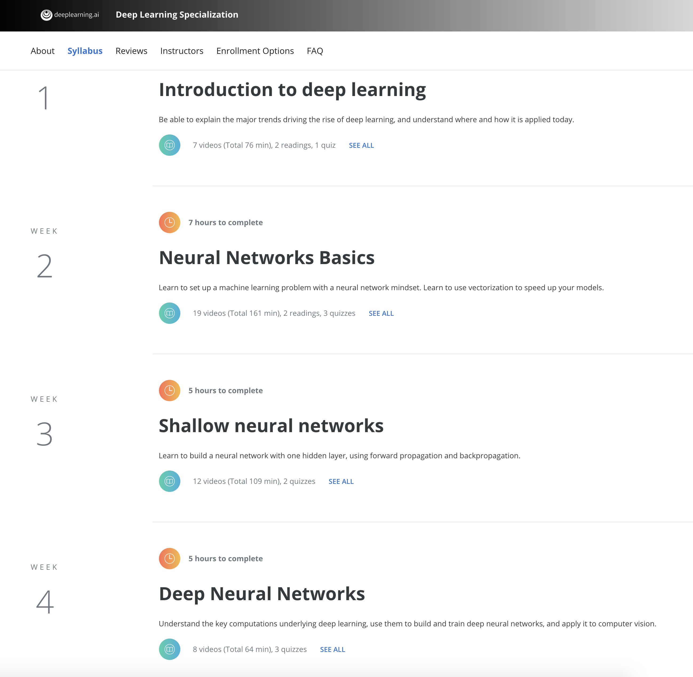

# Neural-Networks-and-Deep-Learning
Neural Networks and Deep Learning repository for all projects and programming assignments of Course 1 of 5 of the Deep Learning Specialization offered on Coursera and taught by Andrew Ng, CEO/Founder Landing AI; Co-founder, Coursera; Adjunct Professor, Stanford University; formerly Chief Scientist,Baidu and founding lead of Google Brain.

**Introduction to deep learning**  
* Be able to explain the major trends driving the rise of deep learning, and understand where and how it is applied today.  

**Neural Networks Basics** 
* Learn to set up a machine learning problem with a neural network mindset. Learn to use vectorization to speed up your models.    

**Shallow neural networks**  
* Learn to build a neural network with one hidden layer, using forward propagation and backpropagation.  

**Deep Neural Networks**  
* Understand the key computations underlying deep learning, use them to build and train deep neural networks, and apply it to computer vision.  

# Links:  
https://www.coursera.org/learn/neural-networks-deep-learning  
https://www.coursera.org/specializations/deep-learning  
https://www.deeplearning.ai  

